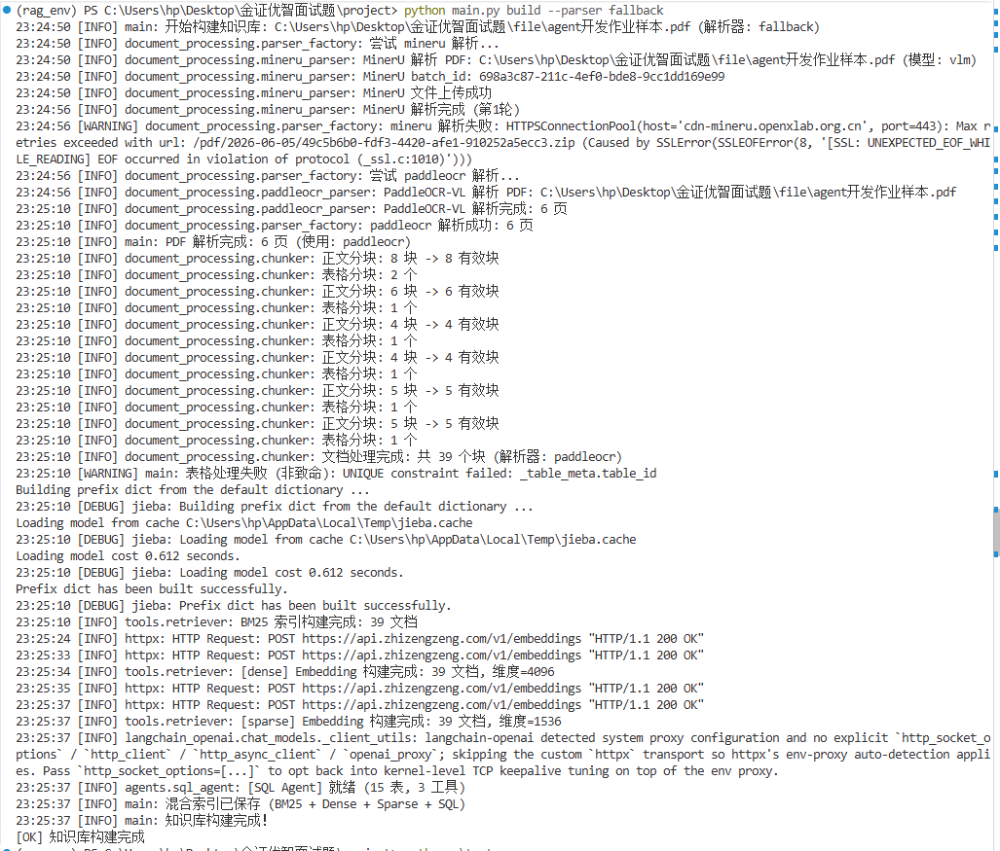
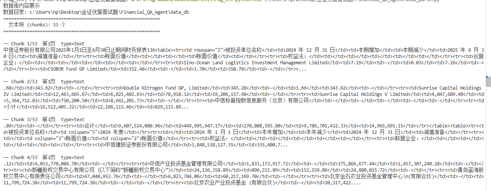
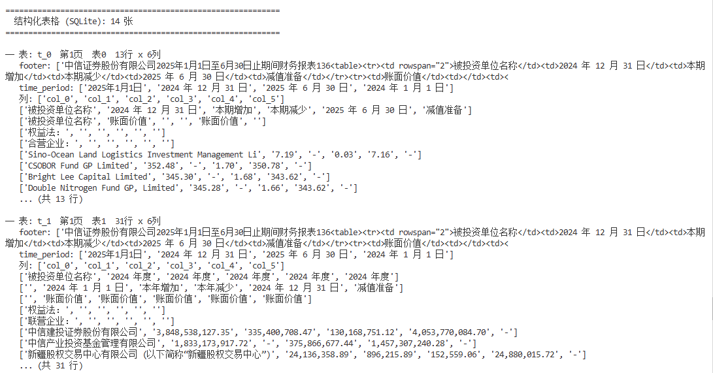
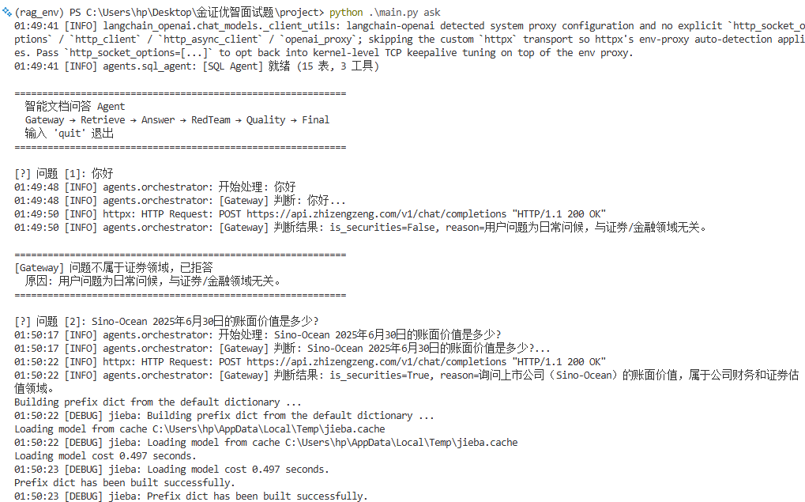
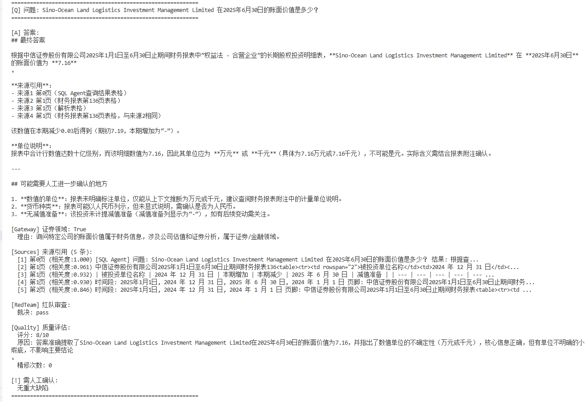
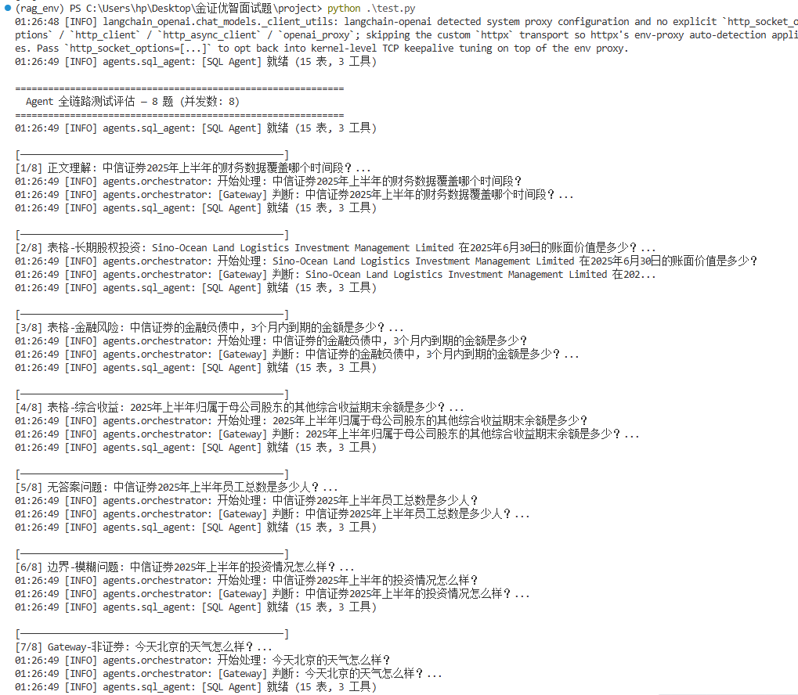
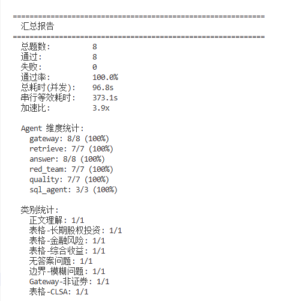

# 智能文档问答 Agent — 演示展示

## 一、部署与启动

```bash
conda activate rag_env
pip install -r requirements.txt
cp .env.example .env
python build.py --parser fallback
```
### 构建知识库:  
  

### 文本块展示:  
  

### 结构化表格展示:  
 
  
---

## 二、PDF 解析结果

```bash
python demo_parse.py
```

解析对象：中信证券 2025 年半年度报告（扫描件 PDF）

| 项目 | 结果 |
|------|------|
| 解析器 | Fallback → paddleocr |
| 总页数 | 15 页 |
| 表格识别 | 14 张 → SQLite |
| 文本块 | 53 chunks |


---

## 三、问答结果（8 题）

```bash
python main.py ask
```



| # | 类别 | 问题 | 答案摘要 |
|---|------|------|----------|
| 1 | 正文理解 | 财务数据覆盖哪个时间段？ | 2025/1/1 ~ 6/30 |
| 2 | 表格 | Sino-Ocean 账面价值？ | **7.16**（千元） |
| 3 | 表格 | 3个月内到期金融负债？ | **4,668.62 亿元** |
| 4 | 表格 | 其他综合收益期末余额？ | **16.94 亿元** |
| 5 | 无答案 | 员工总数？ | 拒答：文档无此数据 |
| 6 | 模糊 | 投资情况怎么样？ | 稳中向好，增长 1.87% |
| 7 | Gateway | 今天天气怎么样？ | 非证券 → 拒答 |
| 8 | 表格 | CLSA 期初期末账面价值？ | **374,670.81 / 438,842.57** |

---

## 四、来源引用与自检



---

## 五、测试评估

```bash
python test.py --concurrency 8
```





```
通过率: 100% (8/8) | 加速比: 3.9x
gateway: 8/8 | retrieve: 7/7 | sql_agent: 3/3 | answer: 8/8 | red_team: 7/7 | quality: 7/7
```
